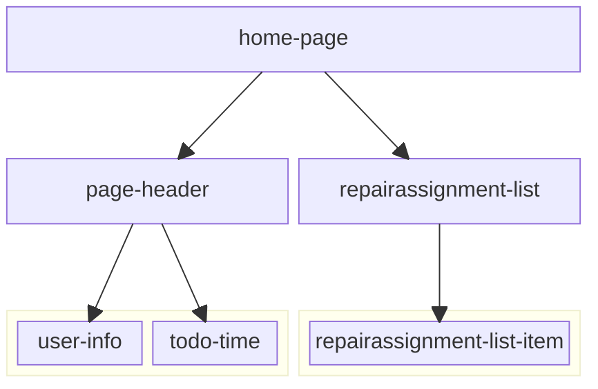
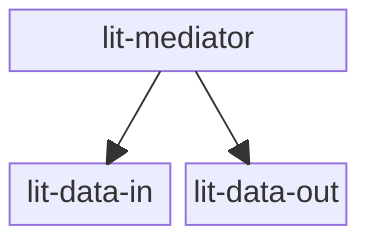

# Assignment 4: Tag Attributes

We can solve solve the problem of displaying the correct estimated total repair time is using tag attributes.

## The DOM tree

So instead of using the `getTotalRepairTime` within the `connectedCallback` of the `todo-time` component, we can pass the total repair time as an attribute to the `todo-time` component.

Taking a look at our DOM tree, we can see that the `todo-time` component is a child of the `page-header` component. So we can pass the total repair time as an attribute down to the `todo-time` component from the `page-header` component.



But this only displaces the problem to the `page-header` component. The `page-header` component is a child of the `home-page` component. So we can pass the total repair time as an attribute down to the `page-header` component from the `home-page` component.

The `home-page` component is the common root of the `todo-time` and `repairassignment-list-item` components, where we triggered the removal of a repairassignment.
So the `todo-time` can calculate the total repair time and pass it up somehow to the `home-page` component.

With Lit Elements we can reflect changes of a property to an attribute. That enables the parent element to read the attribute value (think of it as the `value` attribute of an `input` element) and pass it down to its children.

But webcomponents commenly make use of the shadow DOM. And since the repairassignment-list-item component is a child of the repairassignment-list component, the `home-page` component can't directly access the attributes of the `todo-time` component.

So `repairassignment-list-item` should calculate the total repair time and pass it to it's parent the `repairassignment-list` component. The `repairassignment-list` component should then pass the total repair time up to the `page-header` component.

What we have described here is a common pattern in web development called "**mediator pattern**". It is a way to share state between components that don't have a direct parent-child relationship.

## The Mediator Pattern

To demonstrate the mediator pattern we will use three webcomponents based on the following dom tree:



First we will create the `lit-data-in` component. This component will have a property `dataIn` that will be reflected to an attribute `data-in`.

```javascript
import { LitElement, html, css } from 'lit';

export class LitDataIn extends LitElement {
  static styles = css`
    :host {
      display: block;
      border: 1px solid red;
      margin: 1rem;
      padding: 1rem;
    }
  `;

  static properties = {
    dataIn: { type: String, reflect: true },
  };

  constructor() {
    super();
    this.dataIn = '';
  }

  render() {
    return html`
      <h3>Data In</h3>
      <label for="data-in">Data in:</label>
      <input id="data-in" type="text" .value=${this.dataIn} />
    `;
  }
}

customElements.define('lit-data-in', LitDataIn);
```

Next we will create the `lit-data-out` component. This component will have an attribute `dataOut`.

```javascript
import { LitElement, html, css } from 'lit';

export class LitDataOut extends LitElement {
  static styles = css`
    :host {
      display: block;
      border: 1px solid blue;
      margin: 1rem;
      padding: 1rem;
    }
  `;

  static properties = {
    dataOut: { type: String },
  };

  constructor() {
    super();
    this.dataOut = '';
  }

  render() {
    return html`
      <h3>Data Out</h3>
      <p>Received Data: ${this.dataOut}</p>
    `;
  }
}

customElements.define('lit-data-out', LitDataOut);
```

Finally we will create the `lit-mediator` component. This component will have a property `attrData` that is supposed to get the value of the `dataIn` attribute of the `lit-data-in` component and pass it down to the `dataOut` attribute of the `lit-data-out` component.

```javascript
import { LitElement, html, css } from 'lit';
import './lit-data-in';
import './lit-data-out';

export class LitMediator extends LitElement {
  static styles = css`
    :host {
      display: block;
    }

    section {
      border: 1px solid green;
      padding: 1rem;
      margin: 1rem;
    }
  `;

  static properties = {
    attrData: { type: String },
  };

  constructor() {
    super();
    this.attrData = '';
  }

  render() {
    return html`
      <h2>Mediator</h2>
      <section>
        <lit-data-in dataIn=${this.attrData}></lit-data-in>
        <lit-data-out dataOut=${this.attrData}></lit-data-out>
      </section>
      <hr />
    `;
  }
}

customElements.define('lit-mediator', LitMediator);
```

However this code will not work as expected. In the inspector of your browser you will see that the `dataIn` attribute of the `lit-data-in` component reflects the value you enter in the input field. But the `lit-mediatior` component does not update its `attrData` property to the value of the `dataIn` attribute.
This is because lit does not support two-way bindings. So we have to implement the update of the `attrData` property ourselves.

We start by adding an `dataUpdateHandler` method to the `lit-mediator` component.

```javascript
  dataUpdateHandler() {
    this.attrData = this.shadowRoot.querySelector('lit-data-in').dataIn;
  }
```

But when will this dataUpdateHandler be called? It should be called whenever the `dataIn` attribute of the `lit-data-in` component changes.
We can achieve this by adding an event listener to `lit-data-in` tag within the `lit-mediator`.

```javascript
  render() {
    return html`
      <h2>Mediator</h2>
      <section>
        <lit-data-in @dataUpdate=${this.dataUpdateHandler} dataIn=${this.attrData}></lit-data-in>
        <lit-data-out dataOut=${this.attrData}></lit-data-out>
      </section>
      <hr/>
    `;
  }
```

But what is `@dataUpdate` for an event? Why not `@change` or `@input` etc?
`@change` and `@input` are events that are triggered by the input field of the `lit-data-in` component. It's an event the browsers have defined for input fields.
If we want our own `lit-data-in` component to trigger an event, we have to define it ourselves. In this case we have choosen to call it `dataUpdate`.
`@dataUpdate` is a shorthand for adding the event listener `addEventListener('dataUpdate', this.dataUpdateHandler)` to the `lit-data-in` component.

Now the `lit-mediator` component will update its `attrData` property whenever the `dataIn` attribute of the `lit-data-in` component fires the `dataUpdate` event.

But this currently doesn't happen, because we haven't implemented the `dataUpdate` event in the `lit-data-in` component yet.

First we will add a method `inputHandler` to the `lit-data-in` component.

```javascript
  inputHandler(event) {
    this.dataIn = event.target.value;
    this.dispatchEvent(new CustomEvent('dataUpdate', { bubbles: true, composed: true }));
  }
```

Note that we have to set the `bubbles` and `composed` options to `true`. This is necessary to make the event bubble up to the `lit-mediator` component.
Next we have to call this method whenever the input field changes.

```javascript
  render() {
    return html`
      <h3>Data In</h3>
      <label for="data-in">Data in:</label>
      <input id="data-in" type="text" @input=${this.inputHandler} .value=${this.dataIn}>
    `;
  }
```

And now our mediator pattern is complete. The `lit-data-in` component will pass its `dataIn` attribute to the `lit-mediator` component, which will pass it down to the `lit-data-out` component.

## Considerations

As you can see from this example the mediator pattern is a powerful pattern to share state between components that don't have a direct parent-child relationship. The advantage of this pattern is that the child components are independent of each other.

<details>
  <summary>
    What do you think?
    Is the mediator pattern a good solution for our bike-repair-shop project and why do you think so?
  </summary>

  For our bike-repair-shop project we have to consider that the mediator pattern can make the code harder to understand, since the `todo-time` component and the `repairassignment-list-item` component are not directly via a single parent element connected. This means that the intermediate components have to deal with data that is not relevant to them. That makes the code harder to understand and maintain.

  So the mediator pattern is not always the best solution.

  Therefore it's not a good solution for the bike-repair-shop project.
</details>

---

:house: [Home](../../README.md) | :arrow_backward: [Assignment 3](./assignment3.md) | :arrow_up: [Assignments](./README.md) | [Assignment 5](./assignment5.md) :arrow_forward:
