# Assignment 1: Project Setup

In this RxJS section we continue with the `bike-repair-shop` project we encountered in the routing section.
In order that everyone is on the same page, we will provide you with a boilerplate project that you can clone. 
That project already is a little bit further down the road than the one we used in the routing section.

## The project code

At canvas you will find a Github classroom assignment that will provide you with a boilerplate project.
First you need to clone the project to your local machine.
Then you need to install the dependencies by running `npm install`.
To run the project you will need two terminal windows.
In the first terminal window you will run the backend server by running `npm run backend`.
In the second terminal window you will run the frontend server by running `npm run dev`.
The backend server uses a json-server to provide a REST API. The json-database is located in the `db` folder.

The system supports the following use cases:

```mermaid
flowchart LR
  subgraph 'Bike Repair System'
    uc1((Login))
    uc2((Logout))
    uc3((Create Repair Assignment))
    uc4((List Repair Assignments))
    uc5((Update Repair Assignment))
    uc6((Delete Repair Assignment))
    end

  anonymous[Anonymous User 👤]
  frontdesk[Front Desk 👤]
  mechanic[Bike Doctor 👤]

  anonymous --> uc1
  frontdesk --> uc2
  frontdesk --> uc3
  frontdesk --> uc4
  mechanic ==> frontdesk
  mechanic --> uc5
  mechanic --> uc6
```

:label: This is not a use case diagram, but it comes close. Unfortunately, the tool used [Mermaid](https://mermaid.js.org/) does not support use case diagrams [yet](https://github.com/mermaid-js/mermaid/issues/4628).

When you run the project you first will have to login. As can be seen from the diagram, there are two roles in the system.

> **FrontDesk** employee : 
> username: `dude`
> password: `dude`

and

> **BikeDoctor** employee :
> username: `drwho`
> password: `drwho`

The redirect for anonymous users to the login-page is implemented as an action of the routes within the file `/src/view/router.js`. Doing so, we prevented of implementing this functionality on every page, within the `onBeforeEnter` method.

This project further solves an issue of the product owner, who wants to have an estimate of the total repair time for all the repair assignments. You can find this estimation on the header of each page.

## The problem

So far everything seems to be working fine, but there is a problem. When a repair assignment is removed from the system, the total repair time is not updated.

Try to figure out why that is the case, by analyzing the code.
But don't try to solve it yet, we will do that in the next assignments.

---

:house: [Home](../../README.md) | :arrow_up: [Assignments](./README.md) | [Assignment 2](./assignment2.md) :arrow_forward:
